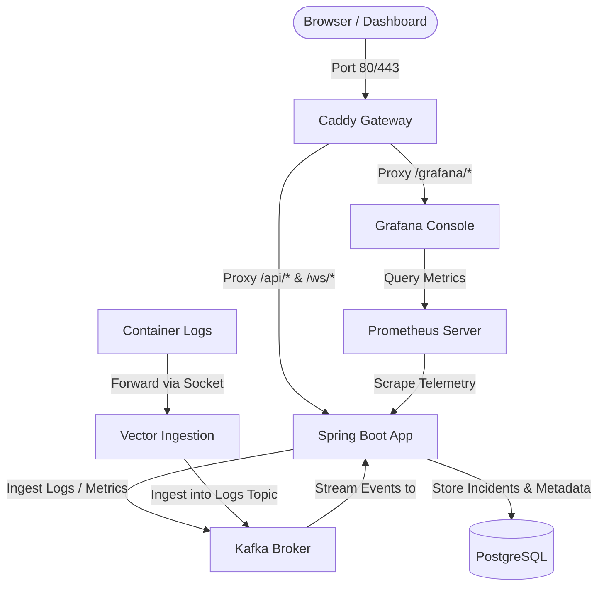

# AIOps Log & Metrics Anomaly Detection Platform

A modern, real-time observability and anomaly detection platform built with a modular-monolith backend communicating asynchronously over Apache Kafka (KRaft), with a STOMP-secured React web dashboard. The platform incorporates in-JVM machine learning, structured incident correlation, and a self-monitoring observability stack.

---

## Architecture Overview



### End-to-End Event Flow
1. **Ingestion**: Log and metric events are published to `logs-topic` and `metrics-topic` via REST controllers or log shippers (e.g., Vector).
2. **Feature Extraction**: Incoming events are windowed inside a concurrency-safe circular buffer. The engine extracts statistical features (mean, stddev, min, max, percentiles, error rates).
3. **Machine Learning Anomaly Detection**: Feature vectors are evaluated in-process using either Welford's streaming Z-score algorithm or a Tribuo One-Class SVM. Scores exceeding threshold publish to `anomaly-topic`.
4. **Incident Correlation**: The incident engine consumes anomalies, groups them per service within a 5-minute rolling window, and correlates them into consolidated `incidents` stored in PostgreSQL.
5. **Real-time Alerting**: Pushes incident notifications over STOMP WebSockets to connected browsers and records unacknowledged entries in the database.
6. **Telemetry & Self-Monitoring**: The platform monitors itself by exposing Micrometer metrics scraped by Prometheus and displayed in Grafana.

---

## Features

- 🛡️ **JWT STOMP WebSocket Security**: Secure STOMP inbound channel interceptors sanitize and authenticate connection handshakes before clients can subscribe to incident streams.
- ⚙️ **Robust Kafka Retry & DLQ**: Configured Stream Binder fallback policies route poisoned messages to Dead Letter Topics (`.DLT`) with exponential backoffs to prevent stream stalls.
- 📈 **Dynamic telemetry**: Displays live Kafka consumer lag metrics fetched dynamically from Micrometer’s JVM `MeterRegistry`.
- 🔄 **Flyway Versioned Migrations**: Automated baseline and version control schemas initialize database state seamlessly without manual execution.
- 🐳 **Optimized Build Times**: Dockerfile includes persistent `BuildKit` cache mounts (`--mount=type=cache`) mapping the Maven local repository cache, reducing build times from minutes to seconds.

---

## Project Structure

```
├── .gitignore
├── Caddyfile
├── Dockerfile
├── docker-compose.yml
├── aiops-dashboard/         # React + Vite + Tailwind Frontend Console
├── grafana/                 # Grafana provisioning configurations
├── prometheus/              # Prometheus scraping configurations
├── vector/                  # Vector log shipper configurations
├── pom.xml                  # Maven configuration file
└── src/
    └── main/
        ├── java/com/aiops/platform/
        │   ├── alert/       # Alerts persistence & DTO mapping
        │   ├── anomaly/     # Streaming buffers & ML detectors (Tribuo/Smile)
        │   ├── auth/        # User authentication & registration controller
        │   ├── common/      # Global configs, exceptions & JWT validation
        │   ├── dashboard/   # WebSockets, Actuator endpoints & summaries
        │   ├── incident/    # Correlation logic & state machines
        │   └── ingestion/   # REST endpoint ingestion & synthetic traffic generators
        └── resources/
            ├── db/migration/# Flyway versioned SQL scripts
            └── application.yml
```

---

## Getting Started

### Prerequisites
- [Docker Desktop](https://www.docker.com/products/docker-desktop/)
- [Node.js v18+](https://nodejs.org/) (for local frontend development)

### Running the Platform

1. **Boot the Backend Stack**:
   Open a terminal in the root directory and start all services via Docker Compose:
   ```bash
   docker compose up --build -d
   ```
   Verify that all services are online and healthy:
   ```bash
   docker compose ps
   ```

2. **Launch the Web Console**:
   Open a new terminal in the `aiops-dashboard` directory:
   ```bash
   npm install
   npm run dev
   ```
   Open your browser and navigate to `http://localhost:5173`.

3. **Login Credentials**:
   - **Username**: `admin`
   - **Password**: `adminpass`

---

## Service Endpoints

| Service | Address | Description |
|---|---|---|
| **Caddy Gateway** | `http://localhost:80` | Reverse proxy routing all API, WS, and Grafana traffic |
| **Spring Boot Application** | `http://localhost:8080` | Core backend JVM application |
| **Grafana Monitoring** | `http://localhost:3000` | System metrics visualization panel |
| **Prometheus Telemetry** | `http://localhost:9090` | Raw time-series database metrics scraper |
| **PostgreSQL Database** | `localhost:5432` | Relational database (DB name: `aiops`) |
| **Kafka Broker** | `localhost:9092` | Event broker for message ingestion |

---

## Testing & Quality Control

### Running Local Tests
- **Backend Unit & Static Analysis Tests**: Run compilation, SpotBugs static analysis checks (similar to Python `ruff` code quality check), and tests:
  ```bash
  # Run SpotBugs static analysis only
  mvn compile spotbugs:check

  # Run full JUnit test suite
  mvn test
  ```
- **Frontend Lint & Build Checks**: Run the linter (`oxlint`) and production compiler inside the `aiops-dashboard` directory:
  ```bash
  cd aiops-dashboard
  npm run lint
  npm run build
  ```

### Continuous Integration (CI/CD)
The pipeline is defined in [.github/workflows/ci-cd.yml](file:///.github/workflows/ci-cd.yml) and automatically runs on every push and pull request targeting the `main` branch. It executes:
1. **SpotBugs static analysis** on the Java source code to prevent bugs and style regressions.
2. **JUnit 5 unit test cases** (spinning up a PostgreSQL service container).
3. **Oxlint syntax checks** and production compilation on the React web code.

---

